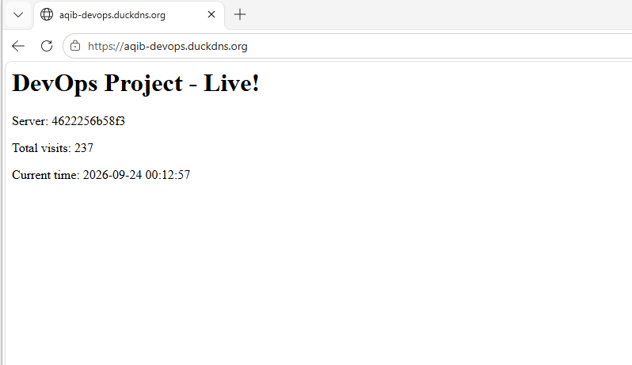
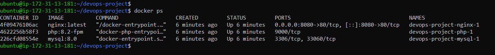
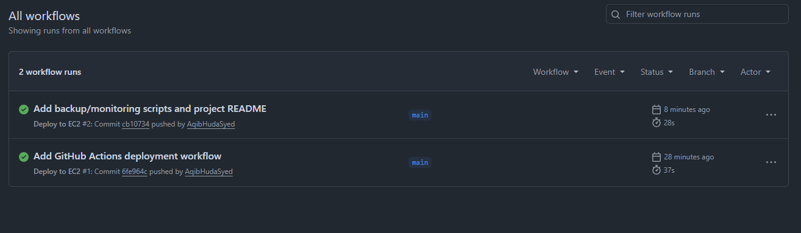
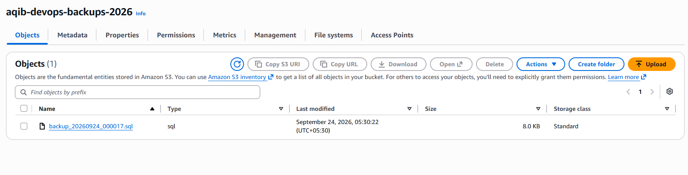
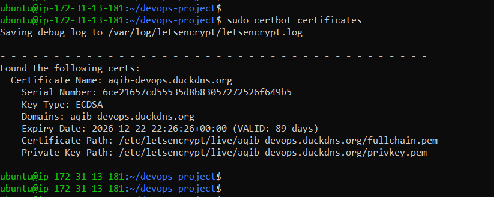
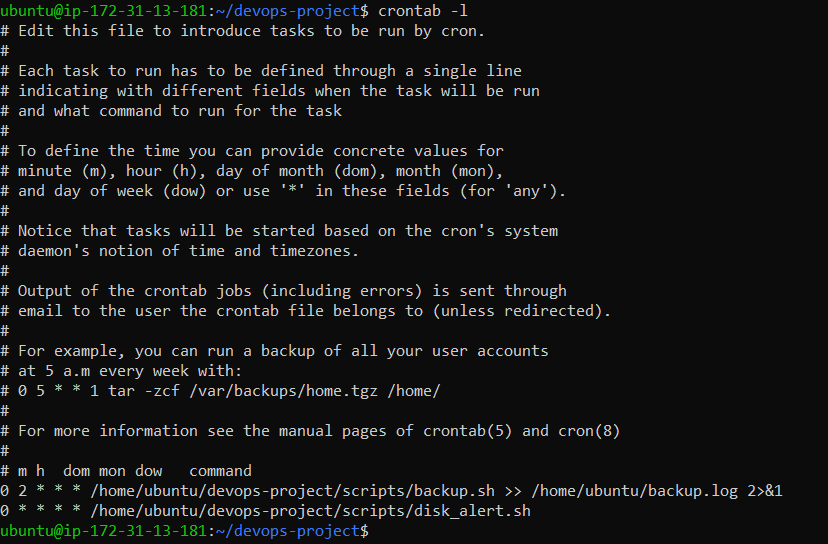
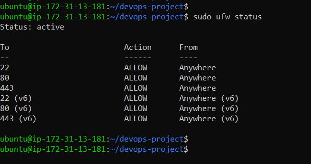

# Cloud DevOps Project — Dockerized PHP App on AWS

A production-style deployment demonstrating cloud infrastructure, containerization, CI/CD, and security practices — built end-to-end on AWS EC2.

## Live Demo
https://aqib-devops.duckdns.org

## Architecture
GitHub (push) → GitHub Actions (CI/CD)
↓
AWS EC2 (Ubuntu, hardened)
↓
Host Nginx (SSL/HTTPS, port 443)
↓
Docker Nginx (reverse proxy, port 8080)
↓
PHP-FPM Container
↓
MySQL Container
↓
Daily automated backup → AWS S3

## Tech Stack
- **Cloud:** AWS EC2, S3, IAM
- **Containers:** Docker, Docker Compose
- **Web Server:** Nginx (reverse proxy + SSL termination)
- **Backend:** PHP 8.2-FPM
- **Database:** MySQL 8.0
- **CI/CD:** GitHub Actions
- **DNS/SSL:** DuckDNS, Let's Encrypt (Certbot)
- **Security:** UFW firewall, Fail2Ban, SSH key-only auth
- **Automation:** Bash scripting, Cron

## Features
- Fully containerized 3-tier application (Nginx + PHP + MySQL)
- Automated CI/CD pipeline — push to `main` auto-deploys to production server
- HTTPS enabled via free SSL certificate with auto-renewal
- Daily automated MySQL backups to AWS S3 (via IAM role, no hardcoded keys)
- Server hardened: key-only SSH, UFW firewall, Fail2Ban intrusion prevention
- Basic health monitoring and disk-space alerting via cron

## Setup / Deployment Steps
1. Launch EC2 instance (Ubuntu 24.04), configure security group (22/80/443)
2. Harden server: disable password auth, enable UFW + Fail2Ban
3. Install Docker, deploy 3-container stack via `docker-compose.yml`
4. Point domain (DuckDNS) to EC2 public IP
5. Install host-level Nginx + Certbot for SSL termination
6. Configure GitHub Actions with SSH secrets for auto-deployment
7. Set up S3 bucket + IAM role for backups
8. Schedule daily backup and monitoring via cron

## What I Learned
- Debugging real container networking issues (MySQL host permissions)
- Setting up secure CI/CD without exposing credentials
- Layered reverse-proxy architecture for SSL termination
- IAM role-based access over hardcoded credentials for AWS security

## Scripts
- `scripts/backup.sh` — MySQL dump → S3 upload
- `scripts/monitor.sh` — Server health check (disk, memory, containers)
- `scripts/disk_alert.sh` — Disk usage threshold alert

## Screenshots

### Live Application (HTTPS with SSL)

### Docker Containers Running

### CI/CD Pipeline — GitHub Actions Successful Deploy

### Automated Backup in AWS S3

### SSL Certificate (Let's Encrypt)

### Automated Cron Jobs (Backup + Monitoring)

### Firewall Configuration (UFW)
